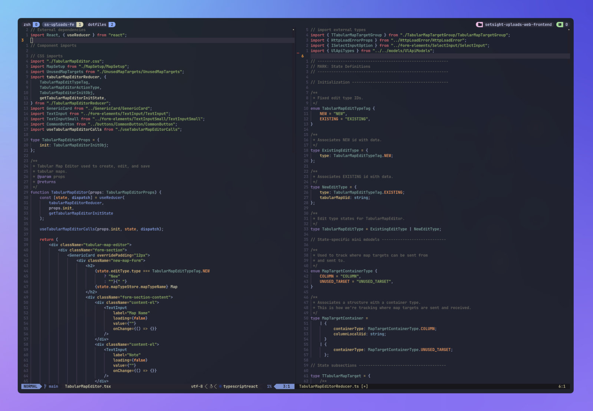

# NvAdam - My personal Neovim configuration.



## Prerequisites

LSP, linting, and formatting features in this config depend on Nodejs. I recommend installing Node via [NVM](https://github.com/nvm-sh/nvm).

I use MacOS and Homebrew. If you're on another system, you will need to follow an alternate method of installation.

```bash
brew install nvm
```

Then add the following to your shell profile (most likely `~/.zshrc`):

```bash
  export NVM_DIR="$HOME/.nvm"
    [ -s "$HOMEBREW_PREFIX/opt/nvm/nvm.sh" ] && \. "$HOMEBREW_PREFIX/opt/nvm/nvm.sh" # This loads nvm
    [ -s "$HOMEBREW_PREFIX/opt/nvm/etc/bash_completion.d/nvm" ] && \. "$HOMEBREW_PREFIX/opt/nvm/etc/bash_completion.d/nvm" # This loads nvm bash_completion
```

Then install the latest version of Node:

```bash
nvm install node
```

Confirm success by running:

```bash
node --version
npm --version
```

## Setup

The contents of this repo will eventually live in your `~/.config/nvim` directory (or wherever you store your config). To start, I'd recommend cloning this repo into your `~/.config` directory, backing up your old config (if there is one), and then renaming the `NvAdam` directory to `nvim`. This way if you want to pull an update it's a simple `git pull` and you're good to go. This process might look something like this, depending on where you choose to store your config:

```bash
cd ~/.config
git clone https://github.com/adamtmorgan/NvAdam.git
mv nvim nvim_bak
mv NvAdam nvim
```

You shouldn't have to manually install LSP, linting, and formatting thanks to `ensure-installed` in Mason, but just in case, I have listed the Mason dependencies here. You can manually manage these by opening the Mason interface inside of Neovim by running `:Mason`. The following are all supported in this config:

- LSP
  - bash-language-server (bash)
  - css-lsp (css)
  - docker-compose-language-service (docker-compose)
  - dockerfile-language-server (dockerfile)
  - html-lsp (html)
  - json-lsp (json)
  - lua-language-server (lua)
  - pyright (python)
  - sqlls (sql)
  - tailwindcss-language-server (tailwind.css)
  - taplo (toml)
  - typescript-language-server (typescript)
  - vetur-vls (vue.js)
- Linting
  - eslint_d (javascript)
  - htmlhint (html)
  - sqlfluff (sql)
  - tflint (terraform)
- Formatting
  - ktlint (kotlin formatting)
  - prettierd (formatting js, css, ts, and many others)
  - stylua (lua formatting)
- Hybrid (lsp/lint/format)
  - rust-analyzer (rust)
  - ktlint (kotlin linting)

If you don't want to use some of these LSPs, you can disable
them by visiting the LSP section of the config found in
`lua/plugins/lsp-config.lua`. Keep in mind that you will need to
disable parts in the Mason, nvim-lspconfig, linting, and formatting
sections of that file.

## Notable Custom Bindings and Features

Keybindings in this config are typically assigned
alongside their plugin counterparts. Other generic bindings
are found in `vim.options.lua`.

Also note that ctag bindings are overwritten in this config.
This is because this config relies on LSPs instead.

- `<leader>` = `space`

- New Tab - `<C-t>n` (normal mode)

- Delete Tab - `<C-t>d` (normal mode)

- Next tab - `<C-t>l` (normal mode)

- Previous tab - `<C-t>h` (normal mode)

- Clear search - `<leader>/` aka `:noh<CR>` (normal mode)

- Toggle neo-tree - `<C-b>` (normal mode)

- Find Files (telescope) - `<leader>ff` (normal mode)

- Find Grep (telescope) - `<leader>fg` (normal mode)

- Find Buffer (telescope) - `<leader>fb` (normal mode)

- Delete(remove) hovered buffer - `<C>r` (in telescope Find Buffer results)

- Telescope Next Result - `<C-j>` (in telescope window)

- Telescope Previous Result - `<C-k>` (in telescope window)

- Git Blake Toggle - `:BlameToggle`

- Preview `.md` files in browser - `:MarkdownPreview`

- Stop Previewing `.md` files in browser - `:MarkdownPreviewStop`

- Comment line toggle - `gcc` in normal mode. `gc` in visual mode.

## A Note on Workflow

This Neovim config (for better or worse) has been optimized to work with a set of specific tools (notably Tmux and Alacritty, but others as well). To see details on how I've configured other pieces of my workflow, visit my [dotfiles](https://github.com/adamtmorgan/dotfiles) repository where you can see terminal enhancement configs, recommended MacOS apps to boost productivity, among other things.
