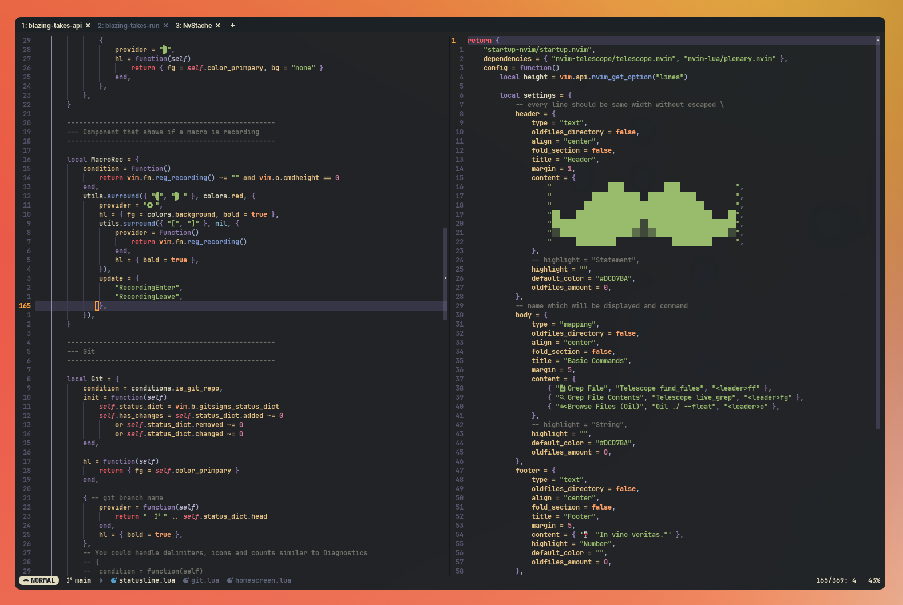

# 〰️ NvStache - My personal Neovim configuration.



# 👉 Say When...

NvStache is a my personal Neovim configuration, tailored for speed and workflow with a carefully-curated plugin selection.
This config is great for web programming (ts, js, css, html, etc.), Rust programming, and general-purpose config editing (xml, yaml, toml, etc.)
I tweak this config as new circumstances arise.

# 👨‍💻 Setup

### 📦 Dependencies

#### ripgrep and fd

This config relies on [ripgrep](https://github.com/BurntSushi/ripgrep) (for live-grep) and [fd](https://github.com/sharkdp/fd) (for file searching).
They are cli search utilities that will DRASTICALLY increase performance inside of [telescope](https://github.com/nvim-telescope/telescope.nvim).
Install them both separately:

```bash
brew install ripgrep \ fd
```

#### `make` and `gcc` or `clang`

This config also uses [telescope-fzf-native](https://github.com/nvim-telescope/telescope-fzf-native.nvim) for enhanced, native-speed fuzzy finding search results.
ripgrep and fd (mentioned above) are great for actually retrieiving the search results, but fzf will greatly speed up the filtering down and ranking of those results so
we see the most relevant results first, and quickly! This plugin is written in C and compiled for best performance. Lazy will actually build this natively for your platform using `make`, hence the dependency.

#### Git ([Lazygit](https://github.com/jesseduffield/lazygit))

This config utilizes Lazygit as the Git client TUI of choice. [lazygit.nvim](https://github.com/kdheepak/lazygit.nvim) (plugin) simply opens a terminal inside of Neovim and opens Lazygit inside of it. For this to work, naturally, you'll need Lazygit installed separately. I highly recommend checking it out if you haven't already.

```bash
brew install jesseduffield/lazygit/lazygit
```

### 🚚 Cloning and Moving Config

The contents of this repo will eventually live in your `~/.config/nvim` directory (or wherever you store your config). I recomend cloning this repo to a desired location and then symlinking it to your `~/.config/nvim` folder. This way you can easily get updates with a simple `git pull`:

```bash
$ cd [your_desired_directory]
$ git clone https://github.com/adamtmorgan/NvStache.git
$ ln -s [your_desired_directory]/NvStache [full_path_to_home]/.config/nvim
```

Alternatively, you can move the repo contents to your `~/.config/nvim` directory, if you don't like linking.

### 1️⃣ One-Time Setups

This config uses [vim-doge](https://github.com/kkoomen/vim-doge) for documentation generation in comments. The first time you run Neovim, you'll have to run the following to install it (per the vim-doge README):

Open Neovim and run:
`:call doge#install()`

## LSP, Linting, and Formatting Servers

You shouldn't have to manually install LSP, linting, and formatting, as the `lsp-config.lua` file checks for a list of Mason registers on Neovim startup. Just in case you require manual intervention, I have listed the Mason dependencies here. You can manually manage these by opening the Mason interface inside of Neovim by running `:Mason`. Just note that if you remove a registered package manually and do not remove it from the `ensure_installed` table in `lsp-config.lua`, the package will be re-installed the next time you open Neovim, so make sure you uninstall via Mason UI as well as removing the item from the `ensure_installed` table. The following are all supported in this config:

#### LSPs

- **bash-language-server**: (keywords: bash)
- **codelldb**: (keywords: c, c++, rust, zig)
- **cpptools**: (keywords: c, c++, rust)
- **css-lsp**: (keywords: css, scss, less)
- **docker-compose-language-service**: (keywords: docker)
- **dockerfile-language-server**: (keywords: docker)
- **eslint-lsp**: (keywords: javascript, typescript)
- **glsl_analyzer**: (keywords: opengl)
- **graphql-language-service-cli**: (keywords: graphql)
- **html-lsp**: (keywords: html)
- **intelephense**: (keywords: php)
- **json-lsp**: (keywords: json)
- **lua-language-server**: (keywords: lua)
- **luau-lsp**: (keywords: luau)
- **prettierd**: (keywords: angular, css, flow, graphql, html, json, jsx, javascript, less, markdown, scss, typescript, vue, yaml)
- **pyright**: (keywords: python)
- **rnix-lsp**: (keywords: nix)
- **rust-analyzer**: (keywords: rust)
- **shfmt**: (keywords: bash, mksh, shell)
- **sqlls**: (keywords: sql)
- **stylua**: (keywords: lua, luau)
- **taplo**: (keywords: toml)
- **terraform-ls**: (keywords: terraform)
- **typescript-language-server**: (keywords: typescript, javascript)
- **vetur-vls**: (keywords: vue)
- **wgsl-analyzer**: (keywords: wgsl)
- **yaml-language-server**: (keywords: yaml)

If you don't want to use some of these LSPs/formatters, you can disable
them by visiting the LSP section of the config found in
`lua/plugins/lsp-config.lua`. Keep in mind that you will need to
disable parts in the Mason, nvim-lspconfig, linting, and formatting
sections of that file.

## ⌨️ Notable Custom Bindings and Features

Keybindings in this config are typically assigned
alongside their plugin counterparts. Other generic bindings
are found in `vim.options.lua`.

Also note that ctag bindings are overwritten in this config.
This is because this config relies on LSPs instead.

- `<leader>` = `space`

- New Tab - `<C-t>n` (normal mode)

- Delete Tab - `<C-t>d` (normal mode)

- Next tab - `<C-t>l` (normal mode)

- Previous tab - `<C-t>h` (normal mode)

- Next buffer - `<leader>l` (normal mode)

- Previous buffer - `<leader>h` (normal mode)

- Delete buffer - `<leader>bd` (normal mode)

- Delete all buffers except current - `:Clean` or `<leader>!`

- Clear search - `<leader>/` aka `:noh<CR>` (normal mode)

- Open CWD in [Oil](https://github.com/stevearc/oil.nvim) - `<leader>o`

- Open most recent buffer directory in [Oil](https://github.com/stevearc/oil.nvim) - `<leader>e`

- Find Files (telescope) - `<leader>ff` (normal mode)

- Find Grep (telescope) - `<leader>fg` (normal mode)

- Find Buffer (telescope) - `<leader>fb` (normal mode)

- Delete(remove) hovered buffer - `<C>r` (in telescope Find Buffer results)

- Telescope Next Result - `<C-j>` (in telescope window)

- Telescope Previous Result - `<C-k>` (in telescope window)

- [Lazygit](https://github.com/jesseduffield/lazygit) (Git client) - `<leader>g`

- Preview `.md` files in browser - `:MarkdownPreview`

- Stop Previewing `.md` files in browser - `:MarkdownPreviewStop`

- Comment line toggle - `gcc` in normal mode. `gc` in visual mode.

- Uses default [flash.nvim](https://github.com/folke/flash.nvim) bindings for quick navigation in view.

- Open marked files using [Arrow](https://github.com/otavioschwanck/arrow.nvim) - `;` - close with `q`

- Open marks in current buffer using [Arrow](https://github.com/otavioschwanck/arrow.nvim) - `m` - close with `q`

- Sessions
  - If a session is saved, it will automatically save current state on Neovim close.
  - Saved sessions are tied to CWD. If a directory is opened and has a saved session, that session will load in automatically.
  - Save session - `<C-s>s`
  - Find session - `<C-s>f`
  - Load session - `<C-s>r`
  - Delete session - `<C-s>d` (when hovering in Find Session window)

## ⚡Neovide Support

If you like speed and flashy animations, check out [Neovide](https://neovide.dev/).
I recommend adding a function to your `.zshrc` file to get the best look without having to type `--frame transparent` every time you want to open.

```bash[.zshrc]
nvide() {
  if [ -z "$1" ]
  then
    neovide --frame transparent
  else
    neovide "$1" --frame transparent
  fi
}
```

With this, you should now be able to run `nvide` or `nvide my/file.lua` and you will have the window formatting that best suits MacOS.

## A Note on Workflow

This Neovim config (for better or worse) has been optimized to work with a set of specific tools (notably Wezterm), and complimentary configs for said tools. For example, nvim has no background color unless in Neovide, yielding said background to your terminal's so transparency effects can work. To see details on how I've configured other pieces of my workflow, visit my [dotfiles](https://github.com/adamtmorgan/dotfiles) repository where you can see terminal enhancement configs, recommended MacOS apps to boost productivity, among other things.
