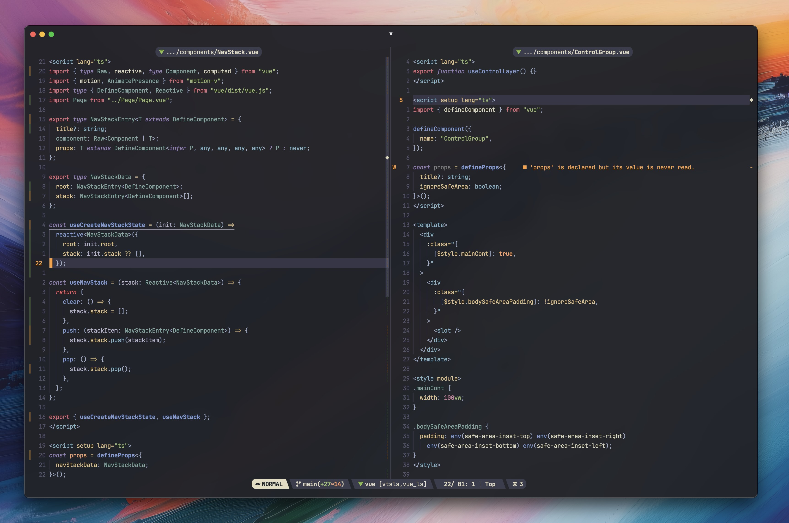

# 〰️ NvStache - My personal Neovim configuration.



# 👉 Say When...

NvStache is a my personal Neovim configuration, tailored for speed and workflow with a carefully-curated plugin selection. This acts as my daily
driver for pretty much everything except for debugging and JVM langauges (Waiting for [Kotlin LSP](https://github.com/Kotlin/kotlin-lsp) +
[Kotlin in Mason](https://github.com/mason-org/mason-registry/pull/10300)). I tweak this config as new circumstances arise.

## Language Integrations

- Lua (obviously)
- HTML
- CSS
- JavaScript/TypeScript
- Vue
- PHP
- Rust
- C/C++
- Python (via pyright)
- Nix
- Bash
- SQL
- GraphQL
- JSON
- Markdown
- TOML
- YAML
- Protobuf
- Dockerfile/Docker-compose
- GLSL/WGSL

## AI Integrations

I'm currently experimenting with [Avante](https://github.com/yetone/avante.nvim), but it's still in the early stages and is not optimized.
Avante undergoes breaking changes constantly at time of writing, so this will likely be unstable for a while.

# 👨‍💻 Setup

### 📦 Dependencies

#### ripgrep and fd

Do yourself a favor and install [ripgrep](https://github.com/BurntSushi/ripgrep) (for live-grep) and [fd](https://github.com/sharkdp/fd) (for file searching).
They are cli search utilities that will DRASTICALLY increase performance inside of [picker](https://github.com/folke/snacks.nvim/blob/main/docs/picker.md).
[picker](https://github.com/folke/snacks.nvim/blob/main/docs/picker.md) automatically uses `fd` and `rg` if they are installed and available.

Install them both separately:

```bash
brew install ripgrep \ fd
```

#### Git ([Lazygit](https://github.com/jesseduffield/lazygit))

This config utilizes Lazygit as the Git client TUI of choice. [lazygit.nvim](https://github.com/kdheepak/lazygit.nvim) (plugin) simply opens a terminal inside of Neovim and opens Lazygit inside of it. For this to work, naturally, you'll need Lazygit installed separately. I highly recommend checking it out if you haven't already.

```bash
brew install jesseduffield/lazygit/lazygit
```

### 🚚 Cloning and Moving Config

The contents of this repo will eventually live in your `~/.config/nvim` directory (or wherever you store your config). I recomend cloning this repo to a desired location and then symlinking it to your `~/.config/nvim` folder. This way you can easily get updates with a simple `git pull`:

```bash
$ cd [your_desired_directory]
$ git clone https://github.com/adamtmorgan/NvStache.git
$ ln -s [your_desired_directory]/NvStache [full_path_to_home]/.config/nvim
```

Alternatively, you can move the repo contents to your `~/.config/nvim` directory, if you don't like linking.

### 1️⃣ One-Time Setups

This config uses [vim-doge](https://github.com/kkoomen/vim-doge) for documentation generation in comments. The first time you run Neovim, you'll have to run the following to install it (per the vim-doge README):

Open Neovim and run:
`:call doge#install()`

## LSP, Linting, and Formatting Servers

You shouldn't have to manually install LSP, linting, and formatting, as the `lsp-config.lua` file checks for a list of Mason registers on Neovim startup and installs them automatically. If you wish omit a language server,
modify the `ensure_installed` table in `lsp-config.lua`.

## ⌨️ Notable Custom Bindings and Features

Keybindings in this config are typically assigned
alongside their plugin counterparts. Other generic bindings
are found in `vim.options.lua`.

Also note that ctag bindings are overwritten in this config.
This is because this config relies on LSPs instead.

- `<leader>` = `space`

- ESC key alternative is `<C-;>` for homerow escaping

- New Tab - `<C-t>n` (normal mode)

- Delete Tab - `<C-t>d` (normal mode)

- Next tab - `<C-t>l` (normal mode)

- Previous tab - `<C-t>h` (normal mode)

- Next buffer - `<leader>l` (normal mode)

- Previous buffer - `<leader>h` (normal mode)

- Delete buffer - `<leader>bd` (normal mode)

- Delete all buffers except current - `:Clean` or `<leader>!`

- Clear search - `<leader>/` aka `:noh<CR>` (normal mode)

- Open CWD in [Oil](https://github.com/stevearc/oil.nvim) - `<leader>e`

- Open most recent buffer directory in [Oil](https://github.com/stevearc/oil.nvim) - `<leader>o`

- Discard changes in [Oil](https://github.com/stevearc/oil.nvim) - `<C-x>`

- Open most recent buffer directory in [Snacks Explorer/Picker](https://github.com/folke/snacks.nvim/blob/main/docs/explorer.md) - `<leader>O`

- Find Files - `<leader>ff` (normal mode)

- Live Grep - `<leader>fg` (normal mode)

- Live Grep Word - `<leader>fG` (normal mode)

- Find Buffer - `<leader>fb` (normal mode)

- Delete(remove) hovered buffer - `<C>x` (in Find Buffer results)

- [Lazygit](https://github.com/jesseduffield/lazygit) (Git client) - `<leader>g`

- Preview `.md` files in browser - `:MarkdownPreview`

- Stop Previewing `.md` files in browser - `:MarkdownPreviewStop`

- Comment line toggle - `gcc` in normal mode. `gc` in visual mode.

- Uses default [flash.nvim](https://github.com/folke/flash.nvim) bindings for quick navigation in view.

- Open marked files using [Arrow](https://github.com/otavioschwanck/arrow.nvim) - `;` - close with `q`

- Open marks in current buffer using [Arrow](https://github.com/otavioschwanck/arrow.nvim) - `m` - close with `q`

- Sessions
  - If a session is saved, it will automatically save current state on Neovim close.
  - Saved sessions are tied to CWD. If a directory is opened and has a saved session, that session will load in automatically.
  - Save session - `<C-s>s`
  - Find session - `<C-s>f`
  - Load session - `<C-s>r`
  - Delete session - `<C-s>d` (when hovering in Find Session window)

## ⚡Neovide Support

If you like speed and flashy animations, check out [Neovide](https://neovide.dev/).
I recommend adding a function to your `.zshrc` file to get the best look without having to type `--frame transparent` every time you want to open.

```bash[.zshrc]
nvide() {
  if [ -z "$1" ]
  then
    neovide --frame transparent
  else
    neovide "$1" --frame transparent
  fi
}
```

With this, you should now be able to run `nvide` or `nvide my/file.lua` and you will have the window formatting that best suits MacOS.

## A Note on Workflow

This Neovim config (for better or worse) has been optimized to work with a set of specific tools, and complimentary configs for
said tools. For example, nvim has no background color unless in Neovide, yielding said background to your terminal's so transparency effects can work.
To see details on how I've configured other pieces of my workflow, visit my [dotfiles](https://github.com/adamtmorgan/dotfiles) repository where you
can see terminal enhancement configs, recommended MacOS apps to boost productivity, among other things.
